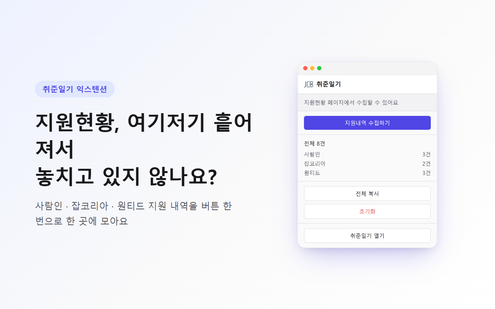
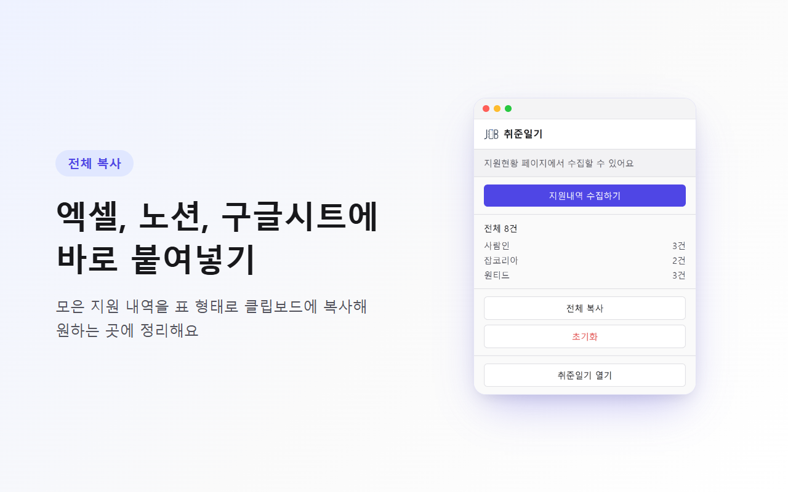
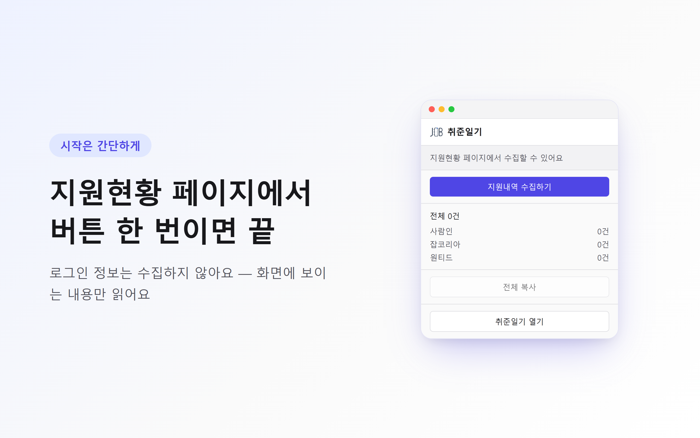

<div align="center">


# 취준일기 익스텐션

**사람인 · 원티드 · 잡코리아 지원 내역을 클릭 한 번으로 수집하는 크롬 익스텐션**

취업 준비생이 여러 채용 플랫폼에 흩어진 지원 현황을, 직접 입력하는 수고 없이 [취준일기](https://github.com/YouVin/jobdiary)로 자동 수집합니다.

[](https://chromewebstore.google.com/detail/afnboeihbppogfinbickjaaadcgjkmil)
[](https://github.com/YouVin/jobdiary-extension/actions/workflows/ci.yml)


**[⬇️ Chrome 웹스토어에서 설치하기](https://chromewebstore.google.com/detail/afnboeihbppogfinbickjaaadcgjkmil)**

<br>



</div>

---

## 개요

취업 준비 과정에서 지원자는 사람인, 원티드, 잡코리아 등 여러 플랫폼에 동시에 지원합니다. 하지만 각 플랫폼은 자사 지원 내역만 보여주기 때문에, 전체 지원 현황을 한눈에 파악하기 어렵습니다.

**취준일기 익스텐션**은 이 문제를 해결합니다. 사용자가 각 채용 사이트의 지원 현황 페이지에서 버튼을 한 번 누르면, 화면에 표시된 지원 내역을 자동으로 수집해 취준일기 대시보드로 전달합니다.

> 노션이나 엑셀에 일일이 입력하는 대신, **"입력이 아니라 수집"** 을 지향합니다.

---

## 주요 기능

| 기능 | 설명 |
|------|------|
| **원클릭 수집** | 지원 현황 페이지에서 버튼 한 번으로 전체 내역 수집 |
| **멀티 플랫폼** | 사람인 · 원티드 · 잡코리아 통합 지원 |
| **상태 자동 매핑** | 각 사이트의 지원 상태를 표준 상태로 자동 변환 |
| **사이트별 누적 저장** | 다시 수집해도 최신 결과로 덮어써 정리 |
| **중복 지원 감지** | 같은 회사·포지션에 다시 지원한 내역을 취준일기 웹앱이 자동으로 알려줌 |
| **안전한 설계** | 로그인 정보를 수집하지 않으며, 화면에 보이는 데이터만 읽음 |

---

## 스크린샷

<div align="center">
<table>
<tr>
<td align="center" width="50%"></td>
<td align="center" width="50%"></td>
</tr>
</table>
</div>

---

## 개인정보 및 보안

이 익스텐션은 **사용자의 로그인 정보(아이디·비밀번호)를 절대 수집하거나 전송하지 않습니다.**

- 서버에서 대신 로그인하는 방식(크롤링)을 사용하지 않습니다.
- 사용자가 **이미 로그인하여 보고 있는 페이지**의 화면 데이터만 읽습니다.
- 수집된 데이터는 사용자의 브라우저(`chrome.storage`)와 취준일기 앱에만 저장됩니다.

이는 대형 채용 솔루션(잡코리아 나인하이어 등)에서도 채택하는 안전한 방식입니다.

---

## 기술 스택

<div align="center">

| 영역 | 기술 |
|------|------|
| **표준** | Manifest V3 |
| **빌드** | Vite + CRXJS |
| **UI** | React 19 + TypeScript |
| **저장** | chrome.storage |

</div>

---

## 아키텍처

```
┌─────────────────────┐     ┌──────────────────┐     ┌─────────────┐
│  채용 사이트 페이지   │     │  Service Worker  │     │   취준일기   │
│  (Content Script)   │ ──▶ │  (백그라운드)     │ ──▶ │   웹 대시보드 │
│                     │     │                  │     │             │
│  · DOM 파싱          │     │  · 상태 매핑      │     │  · 칸반 보드 │
│  · 지원 내역 추출     │     │  · 누적 저장      │     │  · 일기/통계 │
└─────────────────────┘     └──────────────────┘     └─────────────┘
```

자세한 내용은 [아키텍처 문서](./docs/ARCHITECTURE.md)를 참고하세요.

---

## 시작하기

### 지금 바로 사용하기

**[Chrome 웹스토어에서 설치](https://chromewebstore.google.com/detail/afnboeihbppogfinbickjaaadcgjkmil)** — 별도 빌드 없이 바로 설치해서 쓸 수 있습니다.

### 개발 환경에서 실행 (기여자용)

**요구 사항**
- Node.js 18 이상
- Chrome 브라우저

**설치 및 실행**

```bash
# 저장소 클론
git clone https://github.com/YouVin/jobdiary-extension.git
cd jobdiary-extension

# 의존성 설치
npm install

# 개발 모드 실행 (HMR 지원)
npm run dev
```

### 브라우저에 로드

```bash
# 프로덕션 빌드
npm run build
```

1. Chrome에서 `chrome://extensions` 접속
2. 우측 상단 **개발자 모드** 활성화
3. **압축해제된 확장 프로그램을 로드** 클릭
4. 빌드된 `dist` 폴더 선택

---

## 프로젝트 구조

```
jobdiary-extension/
├── src/
│   ├── content/          # 사이트별 content script (DOM 파싱)
│   │   ├── selectors/    # 사이트별 셀렉터 상수
│   │   ├── saramin.ts
│   │   ├── jobkorea.ts
│   │   └── wanted.ts
│   ├── background/       # service worker
│   ├── popup/            # 팝업 UI (React)
│   ├── lib/              # 상태 매핑, 날짜 정규화, 저장 헬퍼
│   └── types/            # 공유 타입 정의
├── docs/                 # 프로젝트 문서
└── manifest 설정
```

---

## 로드맵

- [x] 지원 현황 페이지 HTML 구조 분석 (3개 사이트)
- [x] **M1** · 사람인 지원 내역 수집
- [x] **M2** · 취준일기 웹앱 연동
- [x] **M3** · 잡코리아 · 원티드 확장 (페이지네이션 포함)
- [x] **M4** · 팝업 UI 및 크롬 웹스토어 제출 준비 (설명문·개인정보처리방침·스크린샷 준비 완료)
- [x] **M5** · 유닛 테스트 62개 도입 (vitest + jsdom)
- [x] **M6** · 크롬 웹스토어 심사 제출 및 [게시](https://chromewebstore.google.com/detail/afnboeihbppogfinbickjaaadcgjkmil) 완료

---

## 문서

| 문서 | 설명 |
|------|------|
| [기획](./docs/PLANNING.md) | 프로젝트 목적, 시장 분석, 개발 전략 |
| [셀렉터 명세](./docs/SELECTORS.md) | 사이트별 DOM 셀렉터 및 데이터 매핑 |
| [아키텍처](./docs/ARCHITECTURE.md) | Manifest V3 구조 및 데이터 흐름 |
| [웹앱 연동](./docs/INTEGRATION.md) | 취준일기 웹앱과의 데이터 연동 방식 |
| [스토어 등록 설명문](./docs/STORE_LISTING.md) | 크롬 웹스토어 리스팅용 설명문 |
| [개인정보처리방침](./docs/PRIVACY_POLICY.md) | 크롬 웹스토어 심사용 개인정보처리방침 (실제 게시본: [GitHub Pages](https://youvin.github.io/jobdiary-extension/privacy/)) |
| [권한 사용 이유](./docs/STORE_PERMISSIONS_JUSTIFICATION.md) | 스토어 심사용 권한 정당화 |

---

## 관련 저장소

| 저장소 | 설명 |
|--------|------|
| [jobdiary](https://github.com/YouVin/jobdiary) | 취준일기 웹 대시보드 (칸반 보드, 일기, 통계) |
| **jobdiary-extension** | 지원 내역 수집 크롬 익스텐션 (현재 저장소) |

---

<div align="center">

**취준일기** — 취업 여정을 기록하다

Made with by [YouVin](https://github.com/YouVin)

</div>
